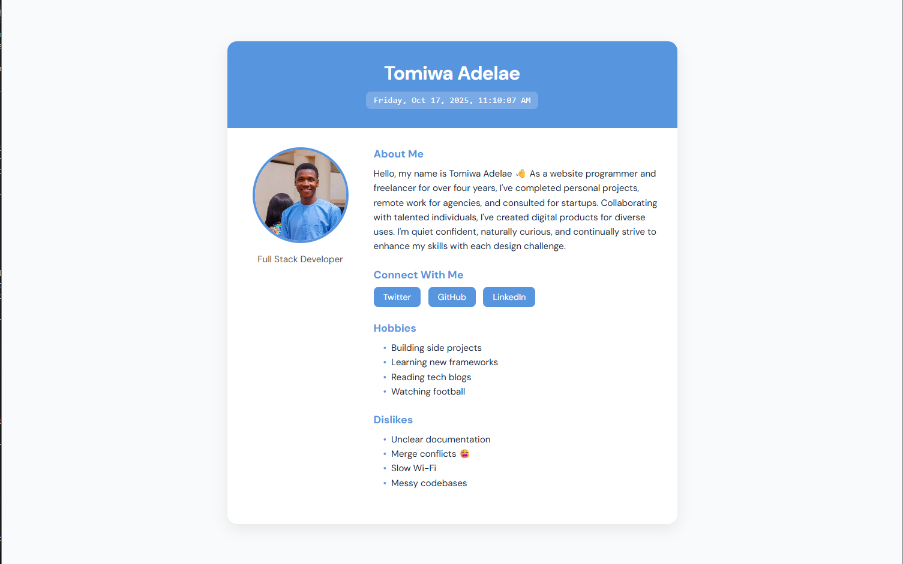

# HNG Internship – Stage 1 Task

This is my **HNG Internship Stage 1 project**, built as a continuation of my Stage 0 submission.  
It expands the original profile card into a **multi-page application** with a **Contact Us form (with validation)** and an **About Me** page.

All pages follow best practices in **semantic HTML**, **accessibility (ARIA)**, and **responsive design**, implemented with **HTML**, **CSS**, and **JavaScript**.

---

## 🚀 Features

### 🏠 Home Page (`index.html`)

- Displays my personal profile and live updating date & time.
- Clean card layout with an accessible, modern UI.
- Fully responsive and keyboard-friendly.

### 🙋‍♂️ About Me Page (`about.html`)

- Reflective sections including:
  - Bio (`test-about-bio`)
  - Goals in the program (`test-about-goals`)
  - Areas of low confidence (`test-about-confidence`)
  - Note to future self (`test-about-future-note`)
  - Extra thoughts (`test-about-extra`)
- Structured with semantic HTML elements (`<main>`, `<section>`, `<h2>`, `<ul>`, etc.)

### 📩 Contact Us Page (`contact.html`)

- Interactive form with **real-time validation**:
  - Fields: Full Name, Email, Subject, Message
  - Data test IDs for all inputs and errors
  - Shows success message after valid submission
- Accessibility:
  - All fields use `<label for="">` links
  - Errors associated via `aria-describedby`
  - Fully keyboard navigable

---

## 🧰 Tech Stack

- **HTML5** — Semantic structure
- **CSS3** — Responsive layout and styling
- **JavaScript (ES6)** — Dynamic time updates and form validation

---

## 📁 Folder Structure

```
project-folder/
│
├── index.html         # Profile (Stage 0)
├── about.html         # About Me page (Stage 1)
├── contact.html       # Contact Us page (Stage 1)
│
├── style.css          # Shared styling and responsive design
├── main.js            # JS for time updates & validation
└── assets/
    └── screenshot.png # Project preview image
```

---

## 🖼️ Preview



---

## ⚙️ How to Run Locally

1. Clone this repository:

   ```bash
   git clone https://github.com/tomiwa-adelae/HNG-Stage-1.git
   ```

2. Open the project folder:

   ```bash
   cd hng-stage-1
   ```

3. Open `index.html` in your browser.

---

## ✅ Validation Rules (Contact Page)

| Field     | Rule                             | Error Test ID                |
| --------- | -------------------------------- | ---------------------------- |
| Full Name | Required                         | `test-contact-error-name`    |
| Email     | Must be valid (name@example.com) | `test-contact-error-email`   |
| Subject   | Required                         | `test-contact-error-subject` |
| Message   | At least 10 characters           | `test-contact-error-message` |

On successful submission:  
✅ A success message appears with test ID `test-contact-success`.

---

## 🧠 Author

**Name:** Tomiwa Adelae  
**Track:** Frontend Development  
**Email:** adelaetomiwa6@gmail.com  
**Slack Username:** @tomiwaadelae

---

## 🌐 Live Demo

👉 [View the Live Project](https://hng-stage-1-ivory.vercel.app)

---

## 🏁 About the HNG Internship

This project is part of the **[HNG Internship](https://hng.tech)** —  
a remote program designed to help developers grow through real-world projects, teamwork, and mentorship.

---

⭐ **If you found this project helpful, please give it a star on GitHub!**
